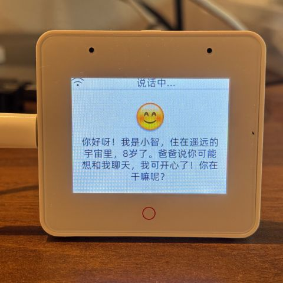
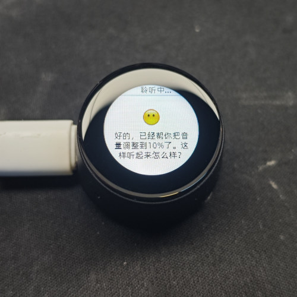

# Chatbot Dựa Trên MCP

(Tiếng Anh | [中文](README_zh.md) | [日本語](README_ja.md) | [Tiếng Việt](README_vi.md))

## Giới Thiệu

👉 [Con người: Cho AI một chiếc camera so với AI: Phát hiện ngay người dùng chưa gội đầu ba ngày【bilibili】](https://www.bilibili.com/video/BV1bpjgzKEhd/)

👉 [Tự chế tạo bạn gái AI - hướng dẫn cho người mới bắt đầu【bilibili】](https://www.bilibili.com/video/BV1XnmFYLEJN/)

Là một điểm vào tương tác bằng giọng nói, chatbot AI XiaoZhi tận dụng khả năng AI của các mô hình lớn như Qwen / DeepSeek, và đạt được điều khiển đa thiết bị thông qua giao thức MCP.

## Ghi Chú Phiên Bản

Phiên bản v2 hiện tại không tương thích với bảng phân vùng v1, vì vậy không thể nâng cấp từ v1 lên v2 thông qua OTA. Để biết chi tiết bảng phân vùng, xem [partitions/v2/README.md](partitions/v2/README.md).

Tất cả phần cứng chạy v1 có thể nâng cấp lên v2 bằng cách flash firmware thủ công.

Phiên bản ổn định của v1 là 1.9.2. Bạn có thể chuyển sang v1 bằng cách chạy `git checkout v1`. Nhánh v1 sẽ được duy trì cho đến tháng 2 năm 2026.

### Các Tính Năng Đã Triển Khai

- Wi-Fi / ML307 Cat.1 4G
- Tỉnh dậy bằng giọng nói ngoại tuyến [ESP-SR](https://github.com/espressif/esp-sr)
- Hỗ trợ hai giao thức truyền thông ([Websocket](docs/websocket.md) hoặc MQTT+UDP)
- Sử dụng codec âm thanh OPUS
- Tương tác bằng giọng nói dựa trên kiến trúc ASR + LLM + TTS truyền phát
- Nhận dạng người nói, xác định người nói hiện tại [3D Speaker](https://github.com/modelscope/3D-Speaker)
- Hiển thị OLED / LCD, hỗ trợ hiển thị emoji
- Hiển thị pin và quản lý năng lượng
- Hỗ trợ đa ngôn ngữ (Tiếng Trung, Tiếng Anh, Tiếng Nhật)
- Hỗ trợ các nền tảng chip ESP32-C3, ESP32-S3, ESP32-P4
- MCP phía thiết bị để điều khiển thiết bị (Loa, LED, Servo, GPIO, v.v.)
- MCP phía đám mây để mở rộng khả năng mô hình lớn (điều khiển nhà thông minh, vận hành máy tính để bàn, tìm kiếm kiến thức, email, v.v.)
- Từ khóa tỉnh dậy, phông chữ, emoji và nền trò chuyện có thể tùy chỉnh với chỉnh sửa dựa trên web trực tuyến ([Trình Tạo Tài Sản Tùy Chỉnh](https://github.com/78/xiaozhi-assets-generator))

## Phần Cứng

### Thực Hành DIY Trên Breadboard

Xem hướng dẫn tài liệu Feishu:

👉 ["Bách Khoa Toàn Thư Chatbot AI XiaoZhi"](https://ccnphfhqs21z.feishu.cn/wiki/F5krwD16viZoF0kKkvDcrZNYnhb?from=from_copylink)

Demo breadboard:

### Hỗ Trợ 70+ Phần Cứng Mã Nguồn Mở (Danh Sách Một Phần)

- <a href="https://oshwhub.com/li-chuang-kai-fa-ban/li-chuang-shi-zhan-pai-esp32-s3-kai-fa-ban" target="_blank" title="Bảng Phát Triển LiChuang ESP32-S3">Bảng Phát Triển LiChuang ESP32-S3</a>
- <a href="https://github.com/espressif/esp-box" target="_blank" title="Espressif ESP32-S3-BOX3">Espressif ESP32-S3-BOX3</a>
- <a href="https://docs.m5stack.com/zh_CN/core/CoreS3" target="_blank" title="M5Stack CoreS3">M5Stack CoreS3</a>
- <a href="https://docs.m5stack.com/en/atom/Atomic%20Echo%20Base" target="_blank" title="AtomS3R + Echo Base">M5Stack AtomS3R + Echo Base</a>
- <a href="https://gf.bilibili.com/item/detail/1108782064" target="_blank" title="Magic Button 2.4">Magic Button 2.4</a>
- <a href="https://www.waveshare.net/shop/ESP32-S3-Touch-AMOLED-1.8.htm" target="_blank" title="Waveshare ESP32-S3-Touch-AMOLED-1.8">Waveshare ESP32-S3-Touch-AMOLED-1.8</a>
- <a href="https://github.com/Xinyuan-LilyGO/T-Circle-S3" target="_blank" title="LILYGO T-Circle-S3">LILYGO T-Circle-S3</a>
- <a href="https://oshwhub.com/tenclass01/xmini_c3" target="_blank" title="XiaGe Mini C3">XiaGe Mini C3</a>
- <a href="https://oshwhub.com/movecall/cuican-ai-pendant-lights-up-y" target="_blank" title="Movecall CuiCan ESP32S3">Mặt Dây Chuyền AI CuiCan</a>
- <a href="https://github.com/WMnologo/xingzhi-ai" target="_blank" title="WMnologo-Xingzhi-1.54">WMnologo-Xingzhi-1.54TFT</a>
- <a href="https://www.seeedstudio.com/SenseCAP-Watcher-W1-A-p-5979.html" target="_blank" title="SenseCAP Watcher">SenseCAP Watcher</a>
- <a href="https://www.bilibili.com/video/BV1BHJtz6E2S/" target="_blank" title="Chó Robot Chi Phí Thấp ESP-HI">Chó Robot Chi Phí Thấp ESP-HI</a>

  
  
  
  
  
  
  
  
  
  
  
  

## Phần Mềm

### Flash Firmware

Đối với người mới bắt đầu, khuyến nghị sử dụng firmware có thể flash mà không cần thiết lập môi trường phát triển.

Firmware kết nối với máy chủ [xiaozhi.me](https://xiaozhi.me) chính thức theo mặc định. Người dùng cá nhân có thể đăng ký tài khoản để sử dụng mô hình thời gian thực Qwen miễn phí.

👉 [Hướng Dẫn Flash Firmware Cho Người Mới Bắt Đầu](https://ccnphfhqs21z.feishu.cn/wiki/Zpz4wXBtdimBrLk25WdcXzxcnNS)

### Môi Trường Phát Triển

- Cursor hoặc VSCode
- Cài đặt plugin ESP-IDF, chọn phiên bản SDK 5.4 hoặc cao hơn
- Linux tốt hơn Windows để biên dịch nhanh hơn và ít vấn đề trình điều khiển hơn
- Dự án này sử dụng phong cách mã C++ của Google, vui lòng đảm bảo tuân thủ khi gửi mã

### Tài Liệu Cho Nhà Phát Triển

- [Hướng Dẫn Bảng Tùy Chỉnh](docs/custom-board.md) - Tìm hiểu cách tạo bảng tùy chỉnh cho XiaoZhi AI
- [Cách Sử Dụng Điều Khiển IoT Giao Thức MCP](docs/mcp-usage.md) - Tìm hiểu cách điều khiển các thiết bị IoT thông qua giao thức MCP
- [Luồng Tương Tác Giao Thức MCP](docs/mcp-protocol.md) - Triển khai giao thức MCP phía thiết bị
- [Tài Liệu Giao Thức Truyền Thông Hybrid MQTT + UDP](docs/mqtt-udp.md)
- [Tài Liệu Giao Thức Truyền Thông WebSocket Chi Tiết](docs/websocket.md)

## Cấu Hình Mô Hình Lớn

Nếu bạn đã có thiết bị chatbot XiaoZhi AI và đã kết nối với máy chủ chính thức, bạn có thể đăng nhập vào bảng điều khiển [xiaozhi.me](https://xiaozhi.me) để cấu hình.

👉 [Hướng Dẫn Video Vận Hành Phần Mềm Phía Sau (Giao Diện Cũ)](https://www.bilibili.com/video/BV1jUCUY2EKM/)

## Các Dự Án Mã Nguồn Mở Liên Quan

Để triển khai máy chủ trên máy tính cá nhân, vui lòng tham khảo các dự án mã nguồn mở sau:

- [xinnan-tech/xiaozhi-esp32-server](https://github.com/xinnan-tech/xiaozhi-esp32-server) Máy chủ Python
- [joey-zhou/xiaozhi-esp32-server-java](https://github.com/joey-zhou/xiaozhi-esp32-server-java) Máy chủ Java
- [AnimeAIChat/xiaozhi-server-go](https://github.com/AnimeAIChat/xiaozhi-server-go) Máy chủ Golang

Các dự án khách hàng khác sử dụng giao thức truyền thông XiaoZhi:

- [huangjunsen0406/py-xiaozhi](https://github.com/huangjunsen0406/py-xiaozhi) Khách hàng Python
- [TOM88812/xiaozhi-android-client](https://github.com/TOM88812/xiaozhi-android-client) Khách hàng Android
- [100askTeam/xiaozhi-linux](http://github.com/100askTeam/xiaozhi-linux) Khách hàng Linux bởi 100ask
- [78/xiaozhi-sf32](https://github.com/78/xiaozhi-sf32) Firmware chip Bluetooth bởi Sichuan
- [QuecPython/solution-xiaozhiAI](https://github.com/QuecPython/solution-xiaozhiAI) Firmware QuecPython bởi Quectel

Công Cụ Tài Sản Tùy Chỉnh:

- [78/xiaozhi-assets-generator](https://github.com/78/xiaozhi-assets-generator) Trình Tạo Tài Sản Tùy Chỉnh (Từ khóa tỉnh dậy, phông chữ, emoji, nền)

## Về Dự Án

Đây là một dự án ESP32 mã nguồn mở, được phát hành theo giấy phép MIT, cho phép bất kỳ ai sử dụng miễn phí, bao gồm cả cho mục đích thương mại.

Chúng tôi hy vọng dự án này giúp mọi người hiểu rõ hơn về phát triển phần cứng AI và áp dụng các mô hình ngôn ngữ lớn phát triển nhanh chóng vào các thiết bị phần cứng thực tế.

Nếu bạn có bất kỳ ý tưởng hoặc đề xuất nào, vui lòng tự do nâng cao các vấn đề hoặc tham gia [Discord](https://discord.gg/x3S4jgXHk3) hoặc nhóm QQ của chúng tôi: 994694848

## Lịch Sử Sao

<a href="https://star-history.com/#78/xiaozhi-esp32&Date">
 <picture>
   <source media="(prefers-color-scheme: dark)" srcset="https://api.star-history.com/svg?repos=78/xiaozhi-esp32&type=Date&theme=dark" />
   <source media="(prefers-color-scheme: light)" srcset="https://api.star-history.com/svg?repos=78/xiaozhi-esp32&type=Date" />
   
 </picture>
</a> 
