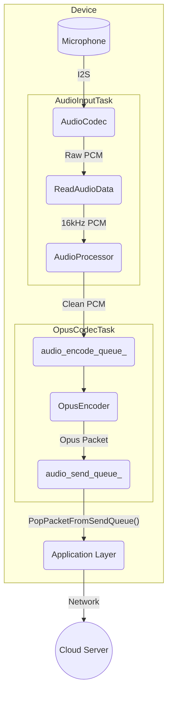
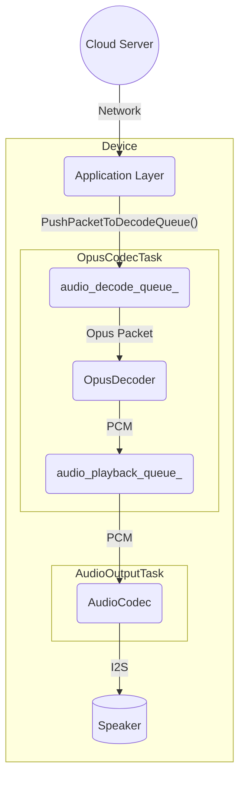

# Kiến Trúc Dịch Vụ Âm Thanh

Dịch vụ âm thanh là một thành phần cốt lõi chịu trách nhiệm quản lý tất cả các chức năng liên quan đến âm thanh, bao gồm quзахвat âm thanh từ micrô, xử lý nó, mã hóa/giải mã và phát lại âm thanh qua loa. Nó được thiết kế theo modular và hiệu quả, chạy các hoạt động chính của nó trong các tác vụ FreeRTOS riêng để đảm bảo hiệu suất theo thời gian thực.

## Các Thành Phần Chính

-   **`AudioService`**: Công viên trung tâm. Nó khởi tạo và quản lý tất cả các thành phần âm thanh khác, tác vụ và hàng đợi dữ liệu.
-   **`AudioCodec`**: Một lớp trừu tượng phần cứng (HAL) cho chip codec âm thanh vật lý. Nó xử lý giao tiếp I2S thô cho đầu vào và đầu ra âm thanh.
-   **`AudioProcessor`**: Thực hiện xử lý âm thanh theo thời gian thực trên luồng đầu vào micrô. Điều này thường bao gồm Hủy Âm Thanh Dư Lượng Âm Học (AEC), chế độ yên tĩnh và Phát Hiện Hoạt Động Giọng Nói (VAD). `AfeAudioProcessor` là triển khai mặc định, sử dụng Giao Diện Phía Trước Âm Thanh ESP-ADF.
-   **`WakeWord`**: Phát hiện từ khóa (ví dụ: "你好，小智", "Hi, ESP") từ luồng âm thanh. Nó chạy độc lập từ bộ xử lý âm thanh chính cho đến khi phát hiện được từ khóa tỉnh dậy.
-   **`OpusEncoderWrapper` / `OpusDecoderWrapper`**: Quản lý mã hóa âm thanh PCM sang định dạng Opus và giải mã các gói Opus trở lại PCM. Opus được sử dụng vì nén cao và độ trễ thấp, làm cho nó lý tưởng cho truyền phát giọng nói.
-   **`OpusResampler`**: Một tiện ích để chuyển đổi các luồng âm thanh giữa các tốc độ mẫu khác nhau (ví dụ: lấy mẫu lại từ tốc độ mẫu gốc của codec sang 16kHz cần thiết cho xử lý).

## Mô Hình Luồng

Dịch vụ hoạt động trên ba tác vụ chính để xử lý các giai đoạn khác nhau của đường ống âm thanh đồng thời:

1.  **`AudioInputTask`**: Chỉ chịu trách nhiệm đọc dữ liệu PCM thô từ `AudioCodec`. Sau đó, nó cung cấp dữ liệu này cho công cụ `WakeWord` hoặc `AudioProcessor` dựa trên trạng thái hiện tại.
2.  **`AudioOutputTask`**: Chịu trách nhiệm phát âm thanh. Nó lấy dữ liệu PCM đã giải mã từ `audio_playback_queue_` và gửi nó tới `AudioCodec` để phát trên loa.
3.  **`OpusCodecTask`**: Một tác vụ công nhân xử lý cả mã hóa và giải mã. Nó tìm nạp âm thanh thô từ `audio_encode_queue_`, mã hóa nó thành các gói Opus và đặt chúng vào `audio_send_queue_`. Đồng thời, nó tìm nạp các gói Opus từ `audio_decode_queue_`, giải mã chúng thành PCM và đặt kết quả vào `audio_playback_queue_`.

## Luồng Dữ Liệu

Có hai luồng dữ liệu chính: đầu vào âm thanh (uplink) và đầu ra âm thanh (downlink).

### 1. Luồng Đầu Vào Âm Thanh (Uplink)

Luồng này quзахвat âm thanh từ micrô, xử lý nó, mã hóa nó và chuẩn bị nó để gửi tới máy chủ.

-   `AudioInputTask` liên tục đọc dữ liệu PCM thô từ `AudioCodec`.
-   Dữ liệu này được cung cấp vào `AudioProcessor` để làm sạch (AEC, VAD).
-   Dữ liệu PCM đã xử lý được đẩy vào `audio_encode_queue_`.
-   `OpusCodecTask` nhận dữ liệu PCM, mã hóa nó thành định dạng Opus và đẩy gói kết quả vào `audio_send_queue_`.
-   Ứng dụng sau đó có thể lấy các gói Opus này và gửi chúng qua mạng.

### 2. Luồng Đầu Ra Âm Thanh (Downlink)

Luồng này nhận dữ liệu âm thanh được mã hóa, giải mã nó và phát nó trên loa.

-   Ứng dụng nhận các gói Opus từ mạng và đẩy chúng vào `audio_decode_queue_`.
-   `OpusCodecTask` lấy các gói này, giải mã chúng trở lại dữ liệu PCM và đẩy dữ liệu vào `audio_playback_queue_`.
-   `AudioOutputTask` lấy dữ liệu PCM từ hàng đợi và gửi nó tới `AudioCodec` để phát.

## Quản Lý Năng Lượng

Để bảo tồn năng lượng, các kênh đầu vào (ADC) và đầu ra (DAC) của codec âm thanh được tự động vô hiệu hóa sau một khoảng thời gian không hoạt động (`AUDIO_POWER_TIMEOUT_MS`). Một bộ hẹn giờ (`audio_power_timer_`) định kỳ kiểm tra hoạt động và quản lý trạng thái năng lượng. Các kênh được tự động kích hoạt lại khi cần quハnhat hoặc phát âm thanh mới.
